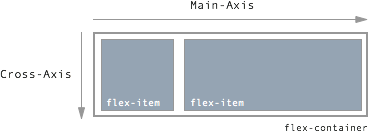
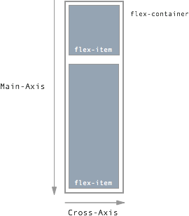

# flexbox
Document describing the CSS flexbox at a high level
#CSS: Flexbox

##Why should I care?
- Vertically aligning elements
- Making equal height columns
- Aligning elements based on a text's baseline

##Overview

In the flex layout model, the children of a flex container can be laid out in
any direction, and can "flex" their sizes, either growing to fill unused
space or shrinking to avoid overflowing the parent.  Both horizontal and vertical
alignment of the children can be easily manipulated.  Nesting of these boxes
(horizontal inside vertical, or vertical inside horizontal) can be used to build
layouts in two dimensions.

- Syntax differences:
  - old syntax (2009)
  - tweener syntax (2011)
  - new syntax (2012)

- Main axis vs. cross axis
  - If flex-direction is row, main axis is horizontal and cross axis is vertical
  - If flex-direction is column, main axis is vertical and cross axis is horizontal

####flex-direction set to row
  

####flex-direction set to column
  

##Browser compatibility
Flexbox has seen increased browser support, however, IE still has many bugs. Check http://caniuse.com/#search=flexbox
for updated support information.
- 93% support for prefixed
- 82% support for unprefixed

##How to use

1. Wrap the elements you want to use flexbox on with a container such as a div or
section.
2. Add a class to the container to target it with your css (ex. flex-container)
3. Add html elements within the container
4. Add classes to the child elements (ex. flex-item)

```html
<section class="flex-container">
  <div class="flex-item"></div>
  <div class="flex-item"></div>
  <div class="flex-item"></div>
</section>
```

###Set the following on your container
- Use css display property
  - display: -webkit-flex;
  - display: -ms-flexbox;
  - display: flex;

- Set the flex-direction (default direction is row).  Options are row,
row-reverse, column, column-reverse.
  - -webkit-flex-direction: row;
  -  -ms-flex-direction: row;
  - flex-direction: row;

- Set the wrap property if you don't want overflow.  Options are nowrap, wrap, wrap-reverse.
  - -webkit-flex-wrap: wrap;
  - -ms-flex-wrap: wrap;
  - flex-wrap: wrap;

- Flex direction and flex wrap can be combined with the shorthand property flex-flow
  - -webkit-flex-flow: row wrap;
  - -ms-flex-flow: row wrap;
  - flex-flow: row wrap;

- Set justify-content to align items across the main axis.  Options are flext-start, flex-end,
center, space-around, space-between
  - -webkit-justify-content: flex-start;
  - -ms-flex-pack: start;
  - justify-content: flex-start;

- Set align-items to align flex items along the cross axis.  Options are flex-start, flex-end,
center, stretch, and baseline
  - -webkit-align-items: flex-start;
  - -ms-flex-align: start;
  - align-items: flex-start;

###Set the following on  your flex items
- Set the flex property
  - syntax "flex: [flex-grow] [flex-shrink] [flex-basis]"
  - -webkit-flex: 1 1 100px;
  - -ms-flex: 1 1 100px;
  - flex: 1 1 100px;

- Set the source property to change the source order of items
  - -webkit-order: [integer];
  - -ms-order: [integer];
  - order: [integer];

###Notes
- As support increases, flexbox will most likely be used in combination with css-grids to control web layouts much
like floats and positioning are used today
- Beware when using margins on your flex-items

  ##Resources
  - http://flexboxfroggy.com/
  - http://flexbox.io/
  - https://css-tricks.com/snippets/css/a-guide-to-flexbox/
  - https://scotch.io/tutorials/a-visual-guide-to-css3-flexbox-properties
  - https://github.com/philipwalton/flexbugs
  - http://www.sketchingwithcss.com/samplechapter/cheatsheet.html
